<!-- Top Animated Hero Banner -->

<!-- Animated Typing Terminal Headline -->

  

<!-- Social Connect Badges -->

  
  
  
  

 

<!-- Live 2026 Contribution Heatmap Terminal -->
<h3><code>siddhantsatote@github ~ $ ./contributions.sh --live</code></h3>

  

<!-- Side by Side Terminal Bento Box (ASCII Portrait + Neofetch System Card) -->
<h3><code>siddhantsatote@github ~ $ whoami --full</code></h3>
<table border="0" align="center" style="border:none; background:transparent;">
  <tr style="border:none; background:transparent;">
    <td valign="top" align="center" style="border:none; padding: 6px;">
      
    </td>
    <td valign="top" align="center" style="border:none; padding: 6px;">
      
    </td>
  </tr>
</table>

  

<!-- Live GitHub Metrics & Activity Streak -->
<h3><code>siddhantsatote@github ~ $ git-stats --activity</code></h3>

<table border="0" align="center" style="border:none; background:transparent;">
  <tr style="border:none; background:transparent;">
    <td valign="middle" align="center" style="border:none; padding: 6px;">
      
    </td>
    <td valign="middle" align="center" style="border:none; padding: 6px;">
      
    </td>
  </tr>
</table>

  

<!-- Terminal Exit Quote -->
<samp>
  <code>siddhantsatote@github ~ $ echo $STATUS &amp;&amp; exit 0</code> 
  ✔ All systems operational &bull; Ready to build next-gen software
</samp>

  

<!-- Bottom Footer Wave -->

